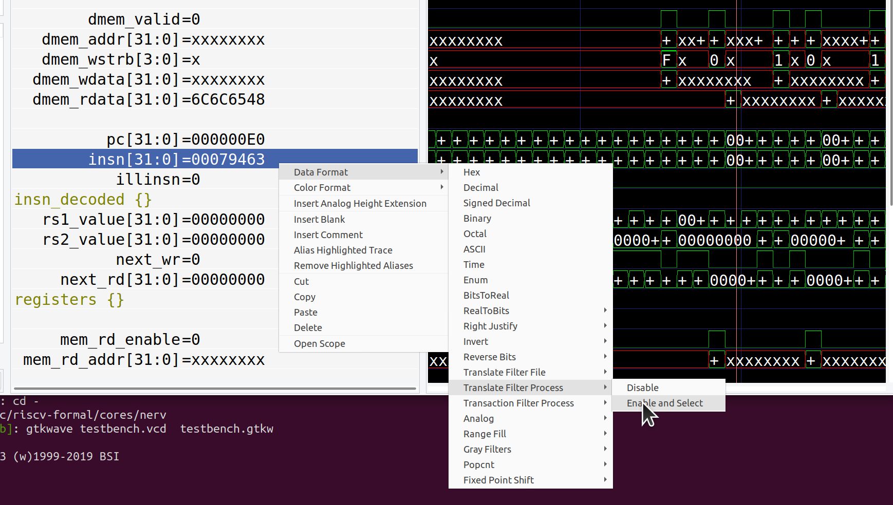

# GTKWave Python filter process

GTKWave can pass your values through a filter and then display the result. This is 
useful for things like:
    
    * state machines codes -> helpful names
    * machine code -> assembly language
    * packed data -> human readable versions

# Setup

Adapt the [example filter](filter-process.py), making sure your lines end with a newline char.

Choose the filter:

Enjoy easier to read traces!

# Examples

* [RISCV instruction decoder](examples/riscv-filter.py)

[youtube video demo](https://youtu.be/Yc16oYOsrTk)

# Attribution

I couldn't get a Python version to work until I saw this filter than can use sigrok protocol decoders:
https://gist.github.com/smunaut/4239a17ea116d5ddfdaecad381f712e9
